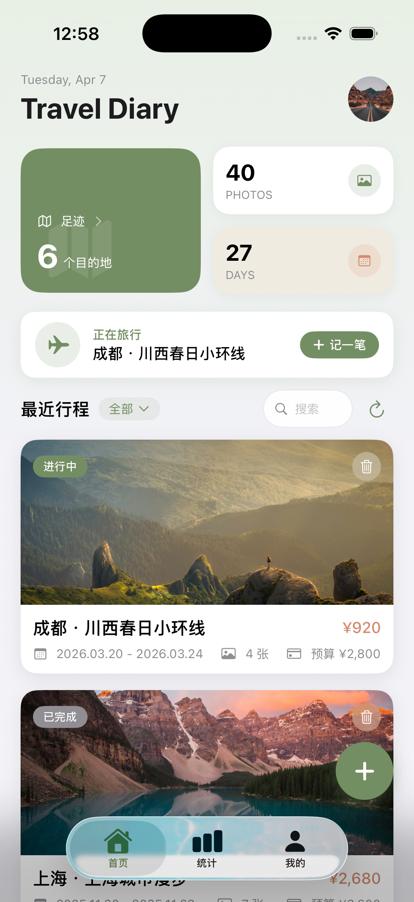
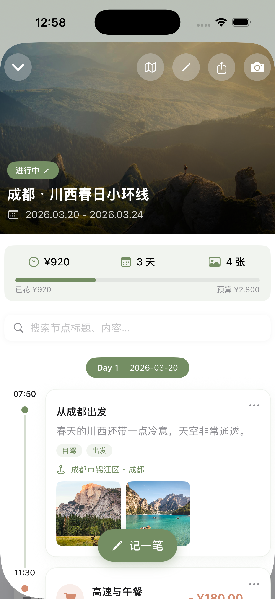
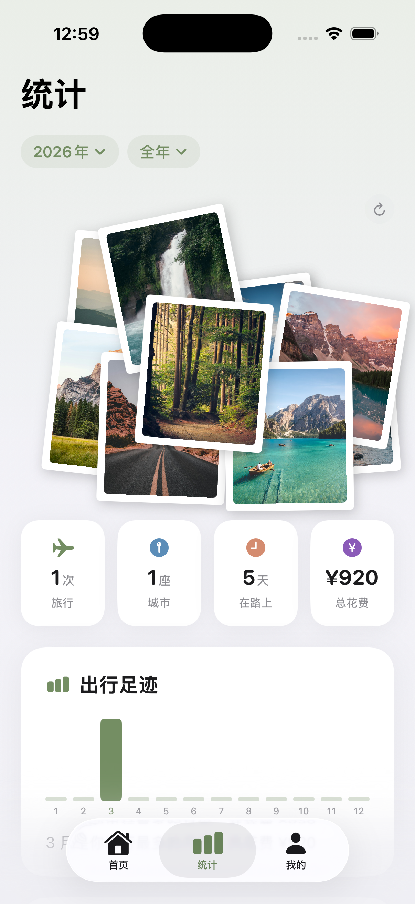
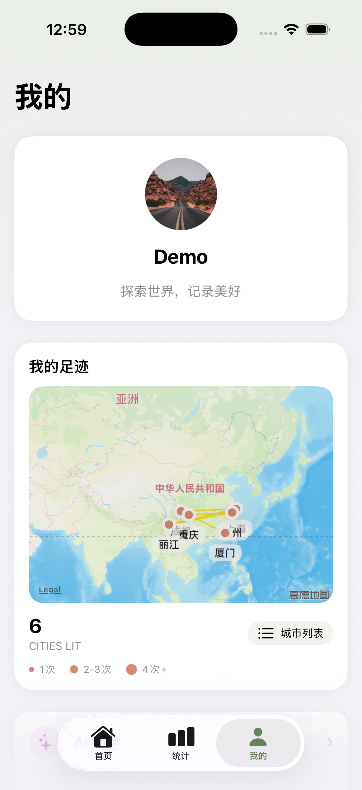
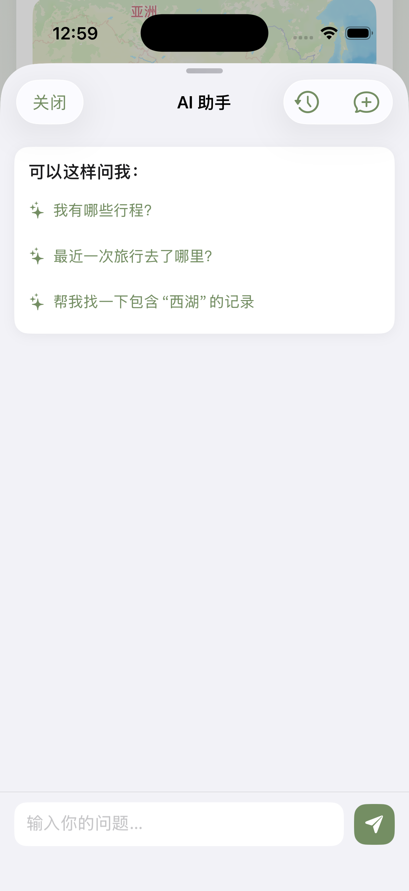
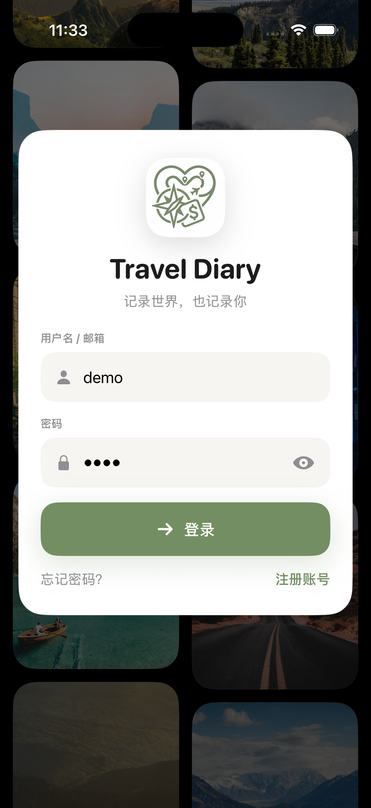
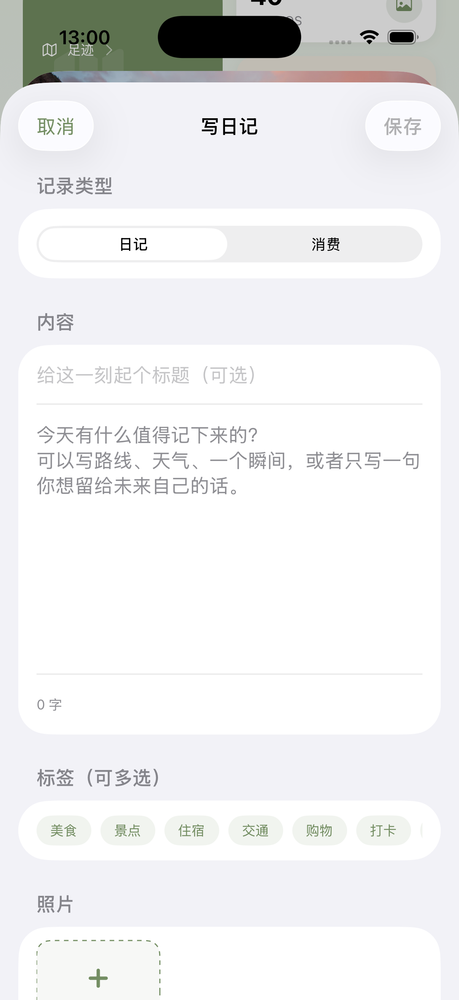
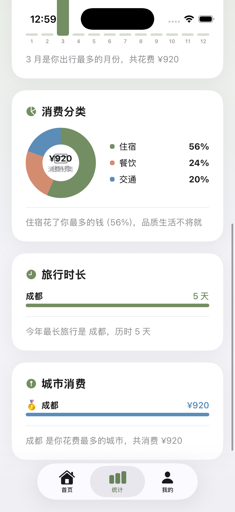
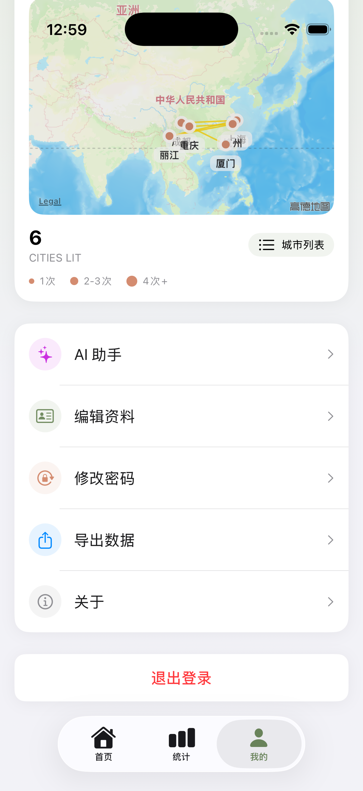

# Travel Diary（旅游日记）

> 一个面向个人旅行记录与回顾的 iOS 产品作品。它把时间轴记录、统计分析、足迹地图和 AI 问答串成了一条完整链路，不只是“记下来”，也能“回头看”和“继续总结”。

<p align="center">
  
  
  
  
  
</p>
## 📸 应用截图

下面展示的是当前 `iOS` 端的真实运行截图。这里直接保留了原始截图的圆角和系统状态栏，尽量保留产品本身的观感。

<p align="center">
  
  
  
</p>

<p align="center">
  
  
</p>

**首页 / 行程列表**

首页聚合最近行程、足迹摘要与关键统计，在信息密度和浏览效率之间做平衡。

**行程详情 / 时间轴**

以时间轴组织旅行过程，把图文记录、地点与消费信息整合到同一条叙事链路中，是整个产品的核心体验。

**统计页**

从旅行、城市、花费与照片维度做聚合展示，强化“回顾”和“总结”这两个价值点。

**个人中心 / 足迹地图**

把资料管理、城市足迹和旅行资产沉淀到同一个入口里，补齐产品闭环。

**AI 助手**

基于个人旅行数据提供问答能力，连接 iOS 客户端、Java 后端与独立 AI 服务，体现完整全栈链路。

这 5 张主图对应的是产品的主流程：

- 从首页进入并浏览已有旅行
- 在详情页按时间轴回看单次旅程
- 在统计页从数据维度重新理解旅行内容
- 在个人中心查看足迹和个人沉淀
- 在 AI 助手中基于个人旅行数据继续提问和总结

<p align="center">
  
  
  
  
</p>

补充细节截图主要用来说明这个项目不是静态展示，而是一个可录入、可统计、可扩展的完整系统。

## 🛠️ 技术栈

| 层级 | 技术 | 说明 |
|---|---|---|
| iOS 客户端 | SwiftUI | 页面组织、状态驱动 UI、交互实现 |
| 业务后端 | Spring Boot 3 | 认证、行程、节点、统计等业务接口 |
| 数据存储 | MySQL | 用户、行程、节点等核心业务数据 |
| 缓存 | Redis | 缓存与状态优化 |
| AI 服务 | FastAPI + SSE | 旅行问答与流式响应 |
| 鉴权 | JWT | 登录态管理 |

**整体链路**

```text
iOS (SwiftUI)
   |
   | HTTP / JSON
   v
Spring Boot Backend
   |
   |-- MySQL: 用户 / 行程 / 节点 / 统计数据
   |-- Redis: 缓存
   |
   | HTTP / SSE
   v
AI Service (FastAPI)
```

这个项目不是只做前端页面，而是把客户端交互、后端接口、数据结构和 AI 能力串成一个完整系统。

## ✨ 核心功能

### 1. 时间轴旅行记录

- 以行程为单位组织旅行内容
- 在单次旅行内混合展示日记记录与消费节点
- 支持进行中 / 已完成状态切换
- 支持封面图、地点信息和多图记录

### 2. 数据统计与回顾

- 旅行次数、城市数、出行天数、总花费聚合展示
- 月度消费趋势
- 消费分类占比
- 城市排行与旅行时长排行
- 照片墙式回顾

### 3. 足迹地图与个人资产

- 基于旅行城市生成足迹地图
- 在个人中心统一管理旅行资产
- 支持资料维护与数据导出

### 4. AI 旅行问答

- 基于个人旅行数据进行问答
- 支持流式回复
- 支持查看最近对话记录

### 5. 内容录入与管理

- 支持新增日记 / 消费两类节点
- 支持标签、照片和文本内容输入
- 支持围绕单次旅行持续补充记录

## 👨‍💻 我负责的部分

- iOS 客户端主要页面与交互设计实现
- Java 后端接口设计与业务联调
- MySQL 数据建模与旅行数据组织
- Redis 缓存接入
- AI 问答能力接入与流式对话联调
- 作品展示所需的演示数据整理与截图规划

这个项目对我来说不是单一端能力展示，而是一次完整的产品实现练习：

- 前端要保证页面完成度和交互连贯性
- 后端要保证行程、节点、统计等业务链路可用
- 数据层要支撑记录、回顾与聚合分析
- AI 能力要建立在真实业务数据之上，而不是孤立功能

## 📌 项目说明

- 当前对外展示重点：`iOS` 端
- 小程序端：仍在开发中
- 当前项目更偏个人作品工程，不以开源协作为目标
- 完整业务源码与敏感配置不在本公开展示仓库中

这个仓库是 **作品展示仓库**，重点给 HR / 面试官快速了解产品完成度、功能结构和我的实现范围。
